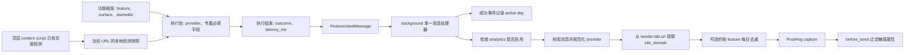

# `feature_used` 埋点契约与上报链路重整计划

## 目标

- 让字段名表达同一种语义：`target_language` 是**本次功能实际选用的目标语言**，由功能执行处提供；不再由 background 给每个事件附上全局配置值，也不引入 `request_target_language`。
- `source_language` 只属于页面翻译。顶层 content script 复用已有页面检测结果，在发送 `feature_used` 之前确定并传给 background；不为其他功能增加语言检测。
- 从一份按 `feature` 区分的类型定义生成调用方输入、消息 payload 和最终 capture 类型。已知必得的字段设为必填，避免在基础类型里堆放 `?`。
- 明确每个字段在哪里产生、何时定值、如何跨消息传递。Background 只补它独有的发送者上下文，不重新推测或读取调用方已知的语言与模式。
- 保留 `feature_used` 的成功/失败、活跃天数、可选每日去重、PostHog 过滤与匿名 ID 的现有行为；只有无法构成完整功能事件的执行前错误不进入 `feature_used`。

## 已定字段语义

| 字段                              | 含义与所有者                                                                              | 适用范围                                       |
| --------------------------------- | ----------------------------------------------------------------------------------------- | ---------------------------------------------- |
| `feature`、`surface`、`startedAt` | 功能触发处建立的本次使用上下文；`startedAt` 只用于计算耗时                                | 所有功能                                       |
| `provider`、`backend_kind`        | 功能解析出的本次 provider；background 在 capture 前规范化                                 | 所有功能；无法解析时用现有 `unknown` 分类      |
| `outcome`、`latency_ms`           | 执行分支决定结果，通用上报 helper 计算耗时                                                | 所有功能                                       |
| `target_language`                 | **本次执行选用的目标语言**，不能从 background 的当前全局配置回填                          | 页面、划词、输入框、翻译中心、视频字幕、术语表 |
| `source_language`                 | 页面翻译启动时的明确源设置；`auto` 时取顶层 content script 已有的页面检测结果，未知时省略 | 仅页面翻译事件                                 |
| `translation_mode`                | 页面翻译启动时读取的模式快照                                                              | 页面翻译                                       |
| `char_count`                      | 本次提交的源文本长度，不含源文本本身                                                      | 划词、输入框、翻译中心                         |
| `action_id`、`action_name`        | 动作标识和可获得的动作名称                                                                | 自定义动作；笔记建议按阶段区分                 |
| `site_domain`                     | 从 `message.sender.tab.url` 提取的 HTTP(S) hostname，不含路径和查询                       | Background 可取得网页 tab 的事件               |

`target_language` 不再出现在朗读、自定义动作和笔记建议事件中，因为这些功能没有统一的“翻译目标语言”。术语表继承宿主翻译调用已经使用的目标语言；不重新读取配置。`source_language` 不扩大到划词、输入框、字幕或 TTS，也不新增检测请求。

## 类型契约

在 `src/types/analytics.ts` 集中定义 `SurfaceByFeature` 和 `ObservedByFeature`，并从中派生 discriminated union。`surface` 的可用值按 feature 收窄，`createFeatureUsageContext` 保留 feature 字面量类型；`action_id`、`action_name`、`char_count` 不再放在所有功能共用的基础类型里。`source_language` 由页面翻译调用方生成，像 `char_count` 一样直接经过消息传到 capture，不再是后台 enrichment。

```ts
type SurfaceByFeature = {
  page_translation:
    "popup" | "floating_button" | "context_menu" | "page_auto" | "shortcut" | "touch_gesture"
  selection_translation: "selection_toolbar" | "context_menu" | "shortcut"
  input_translation: "input_translation"
  translation_hub: "translation_hub"
  video_subtitles: "video_subtitles" | "video_subtitles_auto" | "shortcut"
  text_to_speech: "selection_toolbar" | "context_menu" | "tts_settings"
  custom_ai_action: "selection_toolbar" | "context_menu"
  note_suggestion: "selection_toolbar"
  glossary: "page_translation" | "video_subtitles" | "selection_toolbar" | "input_translation"
}

type ObservedByFeature = {
  page_translation: {
    translation_mode: TranslationMode
    target_language: LangCodeISO6393
    source_language?: LangCodeISO6393
  }
  selection_translation: {
    char_count: number
    target_language: LangCodeISO6393
  }
  input_translation: {
    char_count: number
    target_language: LangCodeISO6393
  }
  translation_hub: {
    char_count: number
    target_language: LangCodeISO6393
  }
  video_subtitles: {
    target_language: LangCodeISO6393
  }
  glossary: {
    target_language: LangCodeISO6393
  }
  custom_ai_action: {
    action_id: string
    action_name?: string
  }
  note_suggestion:
    { action_id: "suggestion_shown" } | { action_id: "suggestion_accepted"; action_name: string }
  text_to_speech: Record<never, never>
}

type FeatureUsedBase = FeatureProviderAnalytics & {
  outcome: AnalyticsOutcome
  latency_ms: number
}

type FeatureUsedMessageFor<F extends AnalyticsFeature> = FeatureUsedBase & {
  feature: F
  surface: SurfaceByFeature[F]
} & ObservedByFeature[F]

type FeatureUsedMessage = {
  [F in AnalyticsFeature]: FeatureUsedMessageFor<F>
}[AnalyticsFeature]

type CapturedFeatureUsedEvent = {
  [F in AnalyticsFeature]: FeatureUsedMessageFor<F> & {
    site_domain?: string
  }
}[AnalyticsFeature]
```

示例省略了已有的 import 与 `AnalyticsFeature` 等基础类型定义。`source_language` 只有页面翻译的 `auto` 检测确实未知时才省略；调用方不传 `auto` 或 fallback `eng`。实际实现不能靠宽泛联合后的断言使编译通过。`Record<never, never>` 仅表示 TTS 没有专属业务字段，消息组装处仍需显式挑选允许的键，不能把任意对象展开后当成精确校验。

`FeatureUsageContext<F>` 只保存 `feature`、对应的 `surface` 和 `startedAt`。`trackFeatureUsed` 接受由 feature 区分的完整输入，生成 `latency_ms` 后发送 `FeatureUsedMessage`；`trackFeatureAttempt` 对同一完整输入决定 `outcome`。调用方不能为一个 feature 传另一个 feature 的专属字段。`src/utils/message.ts` 的 `trackFeatureUsedEvent` 协议也使用该消息联合类型。

### 哪些值可以缺失

- 正常功能事件中的 `translation_mode`、适用功能的 `target_language`、三种文本翻译的 `char_count`、自定义动作的 `action_id` 必填。它们应在构造消息前取得，不用 `?` 掩盖取值顺序问题。
- 自定义动作查找失败时仍可从请求得到 `action_id`，但可能没有 `action_name`；这是调用方字段里唯一保留的可选名称。
- `note_suggestion` 的 `suggestion_shown` 不带 `action_name`；`suggestion_accepted` 必带名称。收紧当前 helper 的 `actionName?: string` 参数以匹配两个实际调用路径。
- `source_language` 在页面配置为 `auto` 且现有检测未完成或没有可信结果时确实可缺失，因此只在页面翻译分支使用 `?`。`site_domain` 对扩展内部页面或缺失 sender tab 也确实可选。
- `config` 未初始化、输入框语言尚未解析等执行前错误无法提供必填字段时，保留本地错误处理/日志，不伪造默认值，也不把不完整数据当作正常 `feature_used`。一旦必填值已确定，其后的 provider、请求或运行失败仍上报 `outcome: "failure"`。
- 自定义动作界面没有 `activeActionId` 时，不存在可归属的动作使用事件；只有拿到 ID 的动作失败才上报。

## 每个功能的取值点

| Feature    | 取值与传递方式                                                                                                                                                                                                                             | 主要代码                                                                                                                         |
| ---------- | ------------------------------------------------------------------------------------------------------------------------------------------------------------------------------------------------------------------------------------------ | -------------------------------------------------------------------------------------------------------------------------------- |
| 页面翻译   | `PageTranslationManager.runStart` 的 `config` 提供本次 `translation_mode` 和 `target_language`。源设置为具体语言时直接传 `source_language`；为 `auto` 时读取顶层 content runtime 已缓存的本页检测结果，有效才传。Background 只校验并转发。 | `src/entrypoints/host.content/runtime.ts`、`src/entrypoints/host.content/translation-control/page-translation.ts`                |
| 划词翻译   | `translateRequest.language.targetCode` 与本次 `preparedText.length` 在 `runTranslation` 已可取得；成功和失败路径共用同一事实快照。                                                                                                         | `src/entrypoints/selection.content/selection-toolbar/translate-button/provider.tsx`                                              |
| 输入框翻译 | 先完成方向交换，再复用 `resolveInputLang` 得到的 `resolvedToLang`。把语言解析与实际执行拆成可复用的一个请求快照，供翻译和埋点同时使用；不能在埋点侧重新解析，也不能上报符号值 `sourceCode`/`targetCode`。`char_count` 取本次输入文本长度。 | `src/entrypoints/selection.content/input-translation/use-input-translation.ts`、`src/utils/host/translate/translate-variants.ts` |
| 翻译中心   | `req.targetLanguage` 和 `req.inputText.length` 随每张 provider 卡片的这次请求快照传递，不读取随后可能变化的 UI state。                                                                                                                     | `src/entrypoints/translation-hub/components/translation-card.tsx`                                                                |
| 视频字幕   | `startTranslation` 已读取 `analyticsConfig`；从这次配置取得目标语言并随现有 `analyticsContext` 保存到成功/失败分支。配置缺失的执行前失败不生成不完整事件。                                                                                 | `src/entrypoints/subtitles.content/universal-adapter.ts`                                                                         |
| 术语表     | `trackGlossaryUsed` 增加必填 `targetLanguage` 参数。页面/输入翻译、划词两条 prompt 路径、字幕路径都已在解析术语时持有 `targetCode`，直接转交，无额外存储读取。                                                                             | `src/utils/glossary/analytics.ts` 及其四处调用                                                                                   |
| 自定义动作 | 执行请求本来要求 `actionId` 和 `actionName`；预检查失败若仍有 ID，则上报失败，未找到动作时省略名称。无 ID 的 UI 错误不生成该事件。                                                                                                         | `src/entrypoints/selection.content/selection-toolbar/custom-action-button/`                                                      |
| 笔记建议   | `action_id` 是展示/接受阶段；展示不带名称，接受路径已有必填名称。                                                                                                                                                                          | `src/utils/note-suggestion/analytics.ts` 及调用处                                                                                |
| 朗读       | 沿用现有 feature、surface、provider、outcome、latency；没有目标语言及源语言字段。                                                                                                                                                          | `src/hooks/use-text-to-speech.tsx`                                                                                               |

## 页面 `source_language` 的取值

沿用现有检测流程：顶层 content script 在 `src/entrypoints/host.content/runtime.ts` 执行 `detectPageLanguageLightweight()`，取得原始的 `LangCodeISO6393 | "und"` 后仍按原流程向 background 发送 `reportDetectedPageLanguage`。同时在该 content script 内保存一份与当前 URL 关联的检测结果，供同一上下文的 `PageTranslationManager` 读取；不新增检测，也不向 background 请求语言。manager 已在该 runtime 中构造，可以通过注入一个读取当前检测结果的 getter 取得它。

页面 manager 使用本次 `runStart` 读取的 `config.language.sourceCode`，在发送 `feature_used` 前按以下顺序确定 `source_language`：

1. 如果配置是具体语言，直接使用该值。
2. 如果配置是 `auto`，只使用与本次页面 URL 匹配、有效且已识别的本地检测结果。
3. 如果检测仍在进行、结果为 `und` 或 URL 已变化，省略 `source_language`；不把 `auto`、`und` 或 fallback `eng` 冒充为源语言，也不阻塞翻译或埋点等待检测。

检测可能跨越页面导航。URL 变动时先使旧的本地快照失效；异步检测完成时只接受仍属于当前 URL、且属于最新检测序号的结果，避免较慢的旧检测覆盖新页面。页面翻译本次启动的 URL 应与所读快照匹配。当前向 background 报告检测结果的存储与面向 popup 的 fallback 行为保持原状；analytics 不再读取已把 `und` 转成 `eng` 的 tab 存储，因此不会误报未知语言。

`source_language` 与 `translation_mode`、`target_language` 一起进入页面翻译的 `FeatureUsedMessage`，background 只做字段校验与透传。删除专用于 analytics 的 `getPageAnalyticsContext` / `page-analytics-context.ts` 及其 background runtime 依赖；该链路不再由 sender tab 决定源语言。

## 消息到 PostHog 的完整链路



`src/entrypoints/background/feature-used-event.ts` 继续作为唯一 `trackFeatureUsedEvent` 订阅者：成功事件的 `recordFeatureActiveDay()` 不依赖 PostHog 开关。Background 在 analytics 启用后对消息按 feature 做运行时字段白名单与必要校验，以兼容旧 content script 消息或异常数据；无完整必填事实的旧消息不伪造值，也不发到 PostHog。Provider 使用现有 `normalizeFeatureProviderAnalytics` 归一化。`site_domain` 仍只来自 sender tab，不接受 payload 中的 URL。

Background 移除 `getTargetLanguage`、`getPageAnalyticsContext` runtime 依赖、所有事件通用的目标语言读取、页面语言查询、`getBackgroundFeatureUsedEventProperties` 包装，以及把 `char_count` 先删再按 feature 复制回来的 `readCharCount` enrichers。最终事件由已校验的消息字段加背景独有的 `site_domain` 组成；`filterAnalyticsCaptureResult` 保留为最后一道属性过滤。

## 实施顺序

1. **契约**：在 `src/types/analytics.ts` 定义 `SurfaceByFeature`、`ObservedByFeature`、消息联合和 capture 联合；收紧 `src/utils/analytics.ts` 的 context、report 与 attempt API，以及 `src/utils/message.ts` 的消息类型。避免通过双重断言跨过不匹配的类型。
2. **执行处目标语言**：逐一修改页面、划词、翻译中心、视频字幕、术语表上报点。输入框先把现有方向解析结果提取成同一次执行使用的请求快照，再传给翻译和埋点。
3. **动作字段**：自定义动作保证 ID；保留动作查找失败时名称可选。笔记建议按展示/接受分支收紧 helper 与调用处。
4. **页面源语言**：在顶层 content runtime 缓存与 URL 关联的原始检测结果，向页面 manager 注入读取接口；manager 根据本次源设置在发送消息前构造 `source_language`，`auto` 无可信结果时省略。Background 不参与取值。
5. **Background 收口**：删除页面 analytics context 查询、通用目标语言读取和无意义的 char count enricher；用仓库现有的 `ts-pattern` 对 feature 做穷尽匹配，在各分支校验并挑选允许的字段，保留活跃天数、去重与 PostHog 过滤流程。
6. **统计迁移**：更新依赖 `target_language` 的 PostHog 查询/说明。旧版本表示全局配置偏好，新版本表示本次执行目标；使用已有 `extension_version` 划分版本，不把两个时期同名属性直接混算。新版非翻译功能不再有该属性。
7. **发布记录**：本次仅调整埋点语义，不生成 `@read-frog/extension` changeset；发布后按扩展版本区分新旧事件数据。

## 验证与完成标准

- 类型检查证明错误 feature/surface 组合、TTS/自定义动作携带 `target_language`、文本翻译缺少 `char_count`、笔记建议接受事件缺少名称均无法通过；正常事件的必得字段不用 `?`。
- 功能测试验证页面模式、目标语言及源设置取自同一次 `runStart` 配置，`source_language` 已在消息中且 background 原样透传；输入框方向交换后上报 `resolvedToLang`，且语言解析只执行一次；翻译中心上报每张卡片自己的请求目标；术语表继承宿主目标。
- 页面检测为 `und`、仍在进行或 URL 不匹配时不产生假 `eng`；显式 source 配置优先于自动检测；旧页面的较慢检测不会覆盖当前快照，缺本地快照不阻断其他字段的 capture。
- Background 测试覆盖非翻译事件没有 `target_language`、不适用 feature 的额外字段被丢弃、hostname 不含路径/查询、provider 归一化和 PostHog 属性过滤。
- 活跃天数仍在成功消息时更新，且不受 analytics opt-in 影响；可选每日去重规则保持现状，笔记建议展示/接受两步仍都可上报。
- `SKIP_FREE_API=true pnpm test`、`pnpm type-check`、`pnpm fmt:check` 通过；按需运行扩展构建验证跨入口消息类型和打包。

## 实施状态

- [x] 类型契约、各功能的目标语言上报、页面源语言本地快照与 background `ts-pattern` 校验已在本分支实现。
- [x] 埋点 changeset 已移除；类型检查与 Chrome 扩展构建通过。推送前全量测试通过：333 个测试文件、3490 个测试。
- [ ] PostHog 中依赖旧 `target_language` 语义的查询需在新扩展版本发布后按 `extension_version` 划分，再切换到新定义。
